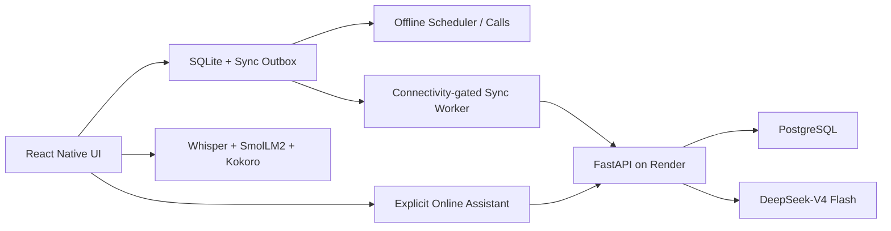

# LAFINA Sprint 7 & 8: Offline-First FastAPI, PostgreSQL, and Cloud AI Plan

## 1. Overview
This design implements Sprint 7 (Cloud accounts, security, PostgreSQL, bidirectional sync) and Sprint 8 (DeepSeek-V4 Flash explicit Online Assistant proxy) while preserving LAFINA's core requirement: **zero-internet operation for scheduling, reminders, STT, NLU, TTS, and local storage.**

## 2. Core Architecture & Security Boundaries

### Key Architectural Constraints
1. **Zero Cloud Imports in Core Offline Modules**: `src/ai/`, `src/storage/`, and `src/scheduler/` NEVER import from `src/cloud/` or `src/sync/`.
2. **Untrusted Client Model**: FastAPI derives `owner_id` exclusively from verified RS256 JWT tokens. `owner_id`, `role`, password hashes, entitlements, AI limits, or client timestamps are rejected if supplied in request payloads.
3. **Database Credentials & API Keys**: Mobile app never receives PostgreSQL credentials or `DEEPSEEK_API_KEY`.
4. **Android Keystore**: Refresh tokens are stored encrypted using AES-GCM via Android Keystore native bridge. Access tokens stay in memory only.

## 3. Sprint 7: Backend Foundation & Authentication

### Tech Stack Additions
- **Backend**: FastAPI, Uvicorn, SQLAlchemy (asyncio + asyncpg), Alembic, `pydantic-settings`, `pwdlib[argon2]`, `pyjwt[crypto]`, `httpx`.
- **Backend Testing & Tooling**: `pytest`, `pytest-asyncio`, `pytest-cov`, `ruff`.
- **Mobile**: `@react-native-community/netinfo`, native Android Keystore bridge. `op-sqlite` retained without replacement.

### Auth & Security Specifications
- **Password Rules**: 15–128 characters, spaces and Unicode allowed, checked against a bundled common-password blocklist.
- **Password Hashing**: Argon2id (>= 19 MiB memory, 2 iterations, 1 lane).
- **Access Tokens**: 15-minute RS256 JWTs with claims (`sub`, `sid`, `jti`, `iss`, `aud`, `iat`, `nbf`, `exp`). Signature and active server-side session check enforced on every endpoint.
- **Refresh Tokens**: 30-day opaque tokens rotated on every refresh; SHA-256 hash stored in PostgreSQL `auth_sessions`.
- **Rate Limits**: Configurable via Pydantic settings:
  - 10 login failures per 15 minutes
  - 100 registrations per IP per hour
  - 10 AI requests per minute
  - 100 AI requests per account per day
- **Payload Limits**: Capped request body at 1 MiB. CORS disabled unless explicitly configured. HTTPS enforced in release.

### PostgreSQL Schema & Row-Level Security (RLS)
- Tables: `accounts`, `auth_sessions`, `recovery_codes`, `profile_sync`, `tasks_sync`, `events_sync`, `time_blocks_sync`, `reminders_sync`, `notes_sync`, `custom_categories_sync`, `idempotent_mutations`, `change_feed`, `ai_usage`, `security_events`.
- Entity ownership key: `(owner_id, client_id)`.
- Server-assigned `change_id` (monotonic BigInt sequence), `updated_at`, and record version.
- Default-deny RLS enabled for runtime API role; migration owner role possesses DDL access.

## 4. Local Schema, Identity, & Guest Migration

### SQLite Non-Destructive Migrations
- Remove destructive schema-recreation code (`DROP TABLE IF EXISTS`) in `src/storage/dbInit.ts`.
- Upgrade PRAGMA `user_version` to target version 6 with non-destructive `ALTER TABLE` / `CREATE TABLE IF NOT EXISTS`.
- Add `updated_at` and `deleted_at` to `custom_categories`.
- Update `active_session` and `remember_me` to include timestamp fields.

### Outbox & Trigger Infrastructure
- Add SQLite tables: `sync_outbox`, `sync_metadata`, `sync_state`, `sync_control`.
- Add SQLite triggers on `tasks`, `events`, `time_blocks`, `reminders`, `notes`, `custom_categories`, `user_preferences`.
- Triggers fire when `sync_control.suppress = 0`, inserting mutations into `sync_outbox` while stripping local-only fields (`precast_audio_path`, `image_uri`).

### Guest Account Migration
- Existing local users remain as offline guest profiles.
- When registering/logging into a cloud account:
  - Present guest data count (tasks, events, reminders, notes, categories).
  - If confirmed: Re-key local items `user_id = cloud_account_id`, enqueue initial sync mutations in outbox, and clear local static password hash.
  - If declined: Retain guest items under local guest profile ID.

## 5. Bidirectional Synchronization Engine (`src/sync/`)

### Batch Sync Contract (`POST /v1/sync/batch`)
- Payload accepts max 100 `SyncMutation` objects (`mutationId`, `entityType`, `entityId`, `operation`, `clientUpdatedAt`, `payload`).
- Strict Pydantic discriminated unions per entity payload (`extra="forbid"`).
- FastAPI applies accepted mutations in received order with Last-Write-Wins (LWW) and `change_id` tie-breaker.
- Returns `SyncBatchResponse` (`accepted`, `rejected`, `changes`, `nextCursor`, `hasMore`, `resetRequired`, `serverTime`). Max 500 changes returned per pull.

### Mobile Sync Worker Lifecycle
- Runs on: app login, start/resume, network connection restored, manual user refresh, and debounced foreground write.
- Pull changes applied inside a single SQLite transaction with `sync_control.suppress = 1` (preventing re-triggering outbox).
- After pull commit: reconciles Android alarms (`src/scheduler/`) and regenerates TTS audio if reminder text changed.
- Feed retention: 90 days. If cursor is older or reset is returned, worker executes full canonical snapshot re-fetch.
- Status indicator states: `Local only`, `Syncing`, `Synced`, `Offline`, `Sign-in required`, `Attention required`.

## 6. Sprint 8: Online AI Proxy (`src/cloud/`, `src/skills/`)

### DeepSeek-V4 Flash Integration
- Endpoint: `POST /v1/ai/chat` in FastAPI.
- Routes request through `httpx` to DeepSeek API using backend environment secret `DEEPSEEK_API_KEY`.
- Input constraints: max 10 messages, max 8,000 total input characters.
- Output constraint: max 1,024 generated tokens.
- Display-only output: text response cannot execute tools or alter scheduling records.
- Typed `CloudResult<T>` error handling for offline, auth required, rate limited, validation error, server error, or timeout.

## 7. Mandatory Verification & Repository Rules
1. Zero TypeScript errors: `npx tsc --noEmit`
2. Full test suite pass: `npm test`
3. Zero ESLint errors: `npx eslint src/`
4. Backend check pass: `ruff check backend/` & `pytest backend/`
5. Coverage: >= 80% on auth, sync, and core storage/scheduler.
